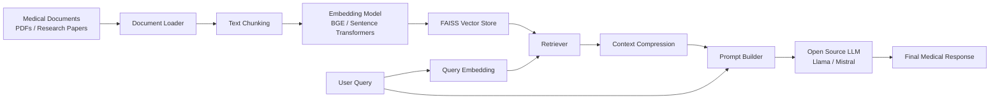

# 🏥 AI-Powered Medical Diagnosis & Treatment Recommendation System

Production-grade Healthcare AI Assistant using FastAPI, LangChain, LangGraph, FAISS, and Open-Source LLMs.

---

# 🚀 Features

- Symptom-based disease prediction
- Medical chatbot
- RAG-based medical retrieval
- PDF ingestion
- Conversational AI
- Clinical guideline retrieval
- AI agents
- FastAPI backend
- Streamlit frontend
- FAISS vector database
- Logging and monitoring

---


# 🧠 Tech Stack

## Backend
- FastAPI
- Python 3.12

## Frontend
- Streamlit

## AI Stack
- LangChain
- LangGraph
- HuggingFace Transformers
- Sentence Transformers

## Vector Database
- FAISS

## Database
- SQLite / PostgreSQL

---

# 📂 Project Structure

```text
ai-healthcare-system/
│
├── app/
├── frontend/
├── data/
├── tests/
├── logs/
├── docker/
│
├── requirements.txt
├── README.md
├── .env.example
├── .gitignore
└── docker-compose.yml
```

---

# ⚙️ Installation

```bash
python -m venv venv

# Windows
venv\Scripts\activate

# Linux/Mac
source venv/bin/activate

pip install -r requirements.txt
```

---

# ▶️ Run Backend

```bash
uvicorn app.main:app --reload
```

---

# ▶️ Run Frontend

```bash
streamlit run frontend/app.py
```

---

# 📜 License

MIT License
